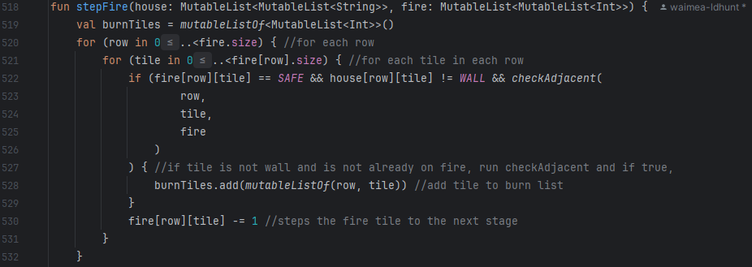
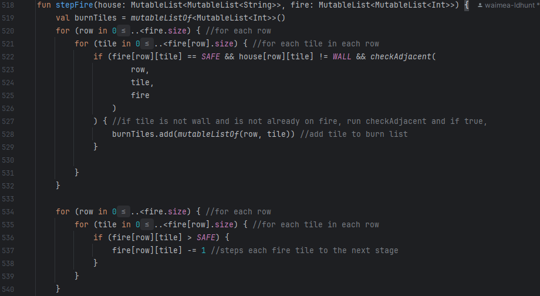

# Results of Testing

The test results show the actual outcome of the testing, following the [Test Plan](test-plan.md)

---

## Example Test Name

Example test description. Example test description.Example test description. Example test description.Example test
description. Example test description.

### Test Data Used

Details of test data. Details of test data. Details of test data. Details of test data. Details of test data. Details of
test data. Details of test data.

### Test Result

Comment on test result. Comment on test result. Comment on test result. Comment on test result. Comment on test result.
Comment on test result.

---

## Fire Spread Test

Checking that the fire spreads correctly and is blocked by walls.

### Test Data Used

Details of test data. Details of test data. Details of test data. Details of test data. Details of test data. Details of
test data. Details of test data.

### Test Result

When testing, I found that the fire was only spreading up and to the left, after further investigation I discovered that
this was caused by a section in the code:

When run, the code checks each tile in an order, but when it checks a tile, it decreases its fire amount buy one,
because these two things were in the same loop, it caused the tile to lose intensity before the tiles after it could
check it. This caused the fire to not spread towards tiles after the fire in the check order. I fixed this by separating
the check and the decrease into two loops as shown below:

When this new code is run, the fire spreads correctly and in all directions.

---

## Example Test Name

Example test description. Example test description.Example test description. Example test description.Example test
description. Example test description.

### Test Data Used

Details of test data. Details of test data. Details of test data. Details of test data. Details of test data. Details of
test data. Details of test data.

### Test Result

Comment on test result. Comment on test result. Comment on test result. Comment on test result. Comment on test result.
Comment on test result.

---
