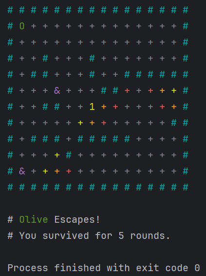
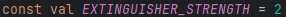

# Results of Testing

The test results show the actual outcome of the testing, following the [Test Plan](test-plan.md)

---

## Setup Test

Testing that the house is set up correctly, the grid is full and the correct size and checking that the fire seed is
placed correctly/in a valid location.

### Test Data Used

Running the code multiple times to check for incorrect setup.

### Test Result

Running the code multiple times showed that the house is set up correctly and conforms to the chosen play area sizes (
sizes do not include the outside border).

---

## Fire Spread Test

Checking that the fire spreads correctly and is blocked by walls.

### Test Data Used

Running the code multiple times to check for unintended fire movement.

### Test Result

When testing, I found that the fire was only spreading up and to the left, after further investigation I discovered that
this was caused by a section in the code:

When run, the code checks each tile in an order, but when it checks a tile, it decreases its fire amount buy one,
because these two things were in the same loop, it caused the tile to lose intensity before the tiles after it could
check it. This caused the fire to not spread towards tiles after the fire in the check order. I fixed this by separating
the check and the decrease into two loops as shown below:

When this new code is run, the fire spreads correctly and in all directions.

---

## Boundary Testing

Testing to make sure that the players cannot move outside the set boundaries.

### Test Data Used

Testing each direction to make sure the player cannot move beyond the boundary.

### Test Result

This testing shows that the players are blocked in all directions if they are attempting to move outside the set
boundaries, these tests also show that the players retain their remaining moves when they encounter an invalid movement.

---

## Invalid Inputs

The program should account for invalid inputs.

### Test Data Used

Testing valid and invalid inputs for each section that requires player input.

### Test Result

Start Screen Input:

How to Play Input:

Difficulty Input:

Name Input:

Turn Input:

These test results show that the program correctly handles invalid inputs when an input is required from the player and
the input is either blank or is not a valid option.

---

## Win Conditions

There are three win conditions:
One of the players is engulfed by fire, in that case, the other player wins.
Both of the players are engulfed by fire at the same time, no players win.
The fire can no longer spread, both players win.

### Test Data Used

Play testing for each scenario (running the program multiple times).

### Test Result

One player dies, the other wins:

The fire can no longer spread, both players win:

Both players die at the same time, no one wins.

These results show that in each different scenario, the program ends the game correctly and gives the players the
winners and shows how many rounds that they have survived.

---

### Player Actions / Turns

Player should be able to perform actions correctly and turns should be organised and shown correctly.

### Test Data Used

Running and play testing the program multiple times to investigate weather or not the program handles player turns and
actions correctly.

### Test Result

This test result shows that the players turns are ordered and organised correctly and the actions they make are handled
correctly, the .gif shows the turn order correctly;

Player 1 Move 1

House is shown

Player 1 Move 2

House is shown

Player 2 Move 1

House is shown

Player 2 Move 2

House is shown

Fire moves once

House is shown

Fire moves a second time

House is shown

(repeat)

This is a clear example of the program organising and handling player turns and turn order correctly.

---

### Player Movement / Obstacle Checking

Players should be able to move one tile in any direction that is not blocked by a wall or the fire.

### Test Data Used

Running the program multiple times to test movement and blocking.
Testing attempting to move into walls from multiple directions and moving into fire.

### Test Result

This test result shows that the program correctly checks and blocks movement over obstacles from multiple directions (
shown with wall and fire blocking.)
This test also shows that the program moves the players exactly one tile in the desired direction when not blocked.
These results show that the program is able to handle movement and obstacle checking correctly.

---

### Fire Extinguisher

The fire extinguisher should work as intended and extinguish the fire correctly, removing all fire within the specified
area.

### Test Data Used

Running the program multiple times in order to test whether the fire extinguisher works correctly in different fire
positions.

### Test Result

These tests show that the fire is completely extinguished in an area up to 2 tiles from the player in all directions,
the strength of the fire extinguisher is determined by:

And this is the area from the player where the fire value of every tile within the given area is set to SAFE.

---