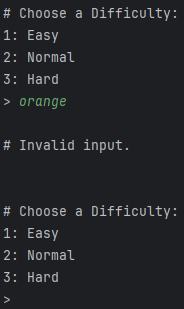

# Results of Testing

The test results show the actual outcome of the testing, following the [Test Plan](test-plan.md)

---

## Setup Test

Testing that the house is set up correctly, the grid is full and the correct size and checking that the fire seed is
placed correctly/in a valid location.

### Test Data Used

Running the code multiple times to check for incorrect setup.

### Test Result

Running the code multiple times showed that the house is set up correctly and conforms to the chosen play area sizes (
sizes do not include the outside border).

---

## Fire Spread Test

Checking that the fire spreads correctly and is blocked by walls.

### Test Data Used

Running the code multiple times to check for unintended fire movement.

### Test Result

When testing, I found that the fire was only spreading up and to the left, after further investigation I discovered that
this was caused by a section in the code:

When run, the code checks each tile in an order, but when it checks a tile, it decreases its fire amount buy one,
because these two things were in the same loop, it caused the tile to lose intensity before the tiles after it could
check it. This caused the fire to not spread towards tiles after the fire in the check order. I fixed this by separating
the check and the decrease into two loops as shown below:

When this new code is run, the fire spreads correctly and in all directions.

---

## Boundary Testing

Testing to make sure that the players cannot move outside the set boundaries.

### Test Data Used

Testing each direction to make sure the player cannot move beyond the boundary.

### Test Result

This testing shows that the players are blocked in all directions if they are attempting to move outside the set
boundaries, these tests also show that the players retain their remaining moves when they encounter an invalid movement.

---

## Example Test Name

Example test description. Example test description.Example test description. Example test description.Example test
description. Example test description.

### Test Data Used

Details of test data. Details of test data. Details of test data. Details of test data. Details of test data. Details of
test data. Details of test data.

### Test Result

Comment on test result. Comment on test result. Comment on test result. Comment on test result. Comment on test result.
Comment on test result.

---

## Invalid Inputs

The program should account for invalid inputs.

### Test Data Used

Testing valid and invalid inputs for each section that requires player input.

### Test Result

These test results show that the program correctly handles invalid inputs when an input is required from the player and
the input is either blank or is not a valid option.

---